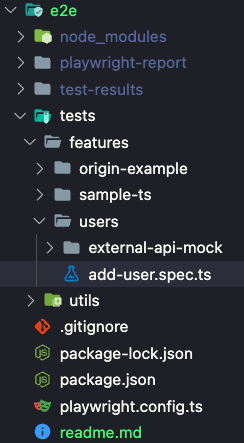

# Separate folders for test cases by feature perspective


# Usage
**please install node 18 and docker-compose first**
## Start Headless test
```
npm ci
npm run test
```

## Start UI test
```
npm run ui
```

## Confirm Test Report
```
npm run report
```

## Generate TypeORM Entities from database
**[typeorm-model-generator](https://www.npmjs.com/package/typeorm-model-generator)**
```
npm run generate:entities # Create Entity class from Database schema
npm run convert:entities # Compile Entity from ts to js
```
**Be careful to use the JS version of Entity when using Entity in your test code.Because Playwright doesn't support experimental Typescript notation like annotations.**

# One-stop test cases
add-user.spec.ts

# Container startup is implemented using testcontainer
containers.ts

I use set gloabl-setup.ts and global-teardown.ts into 
playwright.config.ts to start and stop the container environment before and after playwright starts.

# Use TypeORM to interact with Database
DbDataSource.ts

# User WiremockRestClient to interact with ExternalApi
ExternalApiMock.ts